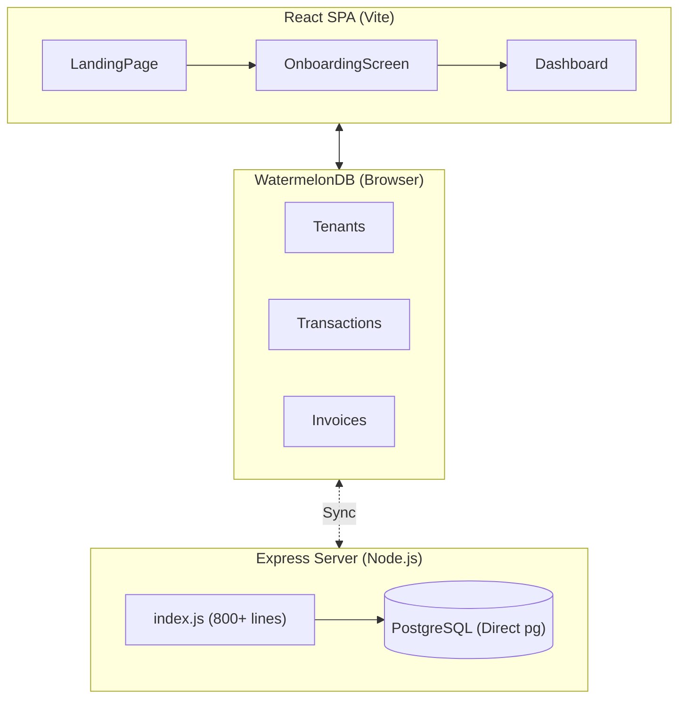

# OpCore: Deep Dive Business & Platform Analysis

> **Prepared by**: AI Product Manager & Product Owner  
> **Date**: January 15, 2026  
> **Scope**: Full codebase analysis, gap identification, and strategic recommendations

---

## Executive Summary

**OpCore** is an **offline-first financial management platform** targeting Nigerian SMEs and individuals who need to comply with the **Finance Act 2024** and **NTA 2025** tax regulations. The core value proposition is **"Tax Compliance on Autopilot, Anywhere"**.

### Key Findings

| Area | Status | Rating |
|------|--------|--------|
| Business Model | Freemium SaaS (Pro @ ₦2,500/mo) | 🟡 Needs Work |
| Data Foundation | PostgreSQL + WatermelonDB | 🟢 Solid |
| Tax Engine Logic | NTA 2025 Triggers + TaxEngine.ts | 🟢 Solid |
| Modularity | Monolithic React Components | 🔴 Critical Gap |
| Admin Panel | Basic "God Mode" (4 pages) | 🔴 Critical Gap |
| Branding System | Tenant-level only | 🟡 Needs Work |
| Marketing Funnel | Landing Page → Register → Upgrade | 🟡 Needs Work |

---

## Part 1: Database & Backend Infrastructure

### 1.1 Database Stack (NOT Supabase)

> [!IMPORTANT]
> **OpCore does NOT use Supabase.** It uses a **direct PostgreSQL connection** via the Node.js `pg` driver.

**Current Configuration** (`server/.env`):
```
DB_USER=postgres
DB_PASSWORD=password
DB_HOST=localhost
DB_PORT=5937
DB_NAME=OpCore
```

**Architecture**:
- **Backend**: Express.js server (`server/index.js`) - monolithic 800+ lines
- **Database**: Self-managed PostgreSQL instance
- **ORM**: None - raw SQL queries via `pg` pool
- **Auth**: Custom bcrypt-based password hashing (no JWT, no sessions)

### 1.2 Supabase Migration Opportunity

| Feature | Current | With Supabase |
|---------|---------|---------------|
| Auth | Custom bcrypt | Supabase Auth (OAuth, Magic Links, MFA) |
| Database | Self-managed PG | Managed PostgreSQL |
| Realtime | Polling/Manual | Built-in Realtime subscriptions |
| Storage | Local `public/uploads` | Supabase Storage (S3-compatible) |
| Edge Functions | None | Deno-based serverless |
| Row-Level Security | Manual checks | Declarative RLS policies |

> [!TIP]
> **Recommendation**: Migrating to Supabase would reduce infrastructure overhead and provide built-in auth, storage, and realtime features. However, the existing PostgreSQL triggers would work seamlessly.

---

## Part 2: Business Model Analysis

### 2.1 Target Personas

| Persona | Account Type | Key Needs |
|---------|--------------|-----------|
| **Salary Earner** | `personal` | Track income, maximize deductions (Rent Relief), PIT calculation |
| **Freelancer** | `personal` | Invoice clients, track expenses, Section 21 compliance |
| **MSME Owner** | `business` | Full ledger, VAT/WHT automation, Capital Allowances, CIT filing |
| **Accountant/Firm** | `business` (Pro) | Multi-client management, white-labeling, reports |

### 2.2 Monetization Strategy

| Tier | Price | Key Features |
|------|-------|--------------|
| **Freemium** | ₦0 | Basic invoicing, turnover tracking, manual entry |
| **Pro** | ₦2,500/mo or ₦25,000/yr | White-label branding, AI Tax Scanner, Bank Feeds, Cloud Backup |
| **Enterprise** | Custom | Multi-user, API access, On-Premise deployment |

### 2.3 Revenue Gaps

- ❌ No payment gateway integration (Paystack mentioned but not implemented)
- ❌ No subscription billing engine
- ❌ No trial expiry logic
- ❌ No referral/affiliate system

---

## Part 3: Technical Architecture

### 3.1 Current Architecture



### 3.2 Strengths

| Component | Assessment |
|-----------|------------|
| **WatermelonDB** | ✅ Excellent for offline-first |
| **PostgreSQL Triggers** | ✅ NTA 2025 compliance automation |
| **TaxEngine.ts** | ✅ Good logic separation start |

### 3.3 Critical Gaps

| Gap | Problem | Impact |
|-----|---------|--------|
| Monolithic Components | 400+ line React files with embedded logic | Untestable, hard to maintain |
| God Context | `TenantContext.tsx` = 1200+ lines | Any change risks breaking unrelated features |
| Basic Admin | 4 placeholder pages | Cannot manage platform effectively |
| No Auth Layer | Plain bcrypt, no sessions/JWT | Security risk, no SSO support |

---

## Part 4: Admin Panel Assessment

### Current Capabilities

| Feature | Status |
|---------|--------|
| View User List | ✅ Basic table |
| Edit User | ❌ Button exists but non-functional |
| Compliance Queue | ✅ Approve/Reject (mock) |
| Tax Config | ✅ VAT Rate, Pricing |
| Audit Logs | ❌ Empty placeholder |
| Analytics | ❌ Not implemented |
| Content Management | ❌ Not implemented |

### Required Admin Features

- User CRUD with impersonation
- Subscription management (upgrade/downgrade/refund)
- Real-time analytics dashboard
- Compliance document review workflow
- Full audit trail

---

## Part 5: Branding System

### Tenant-Level (Exists)

| Field | Usage |
|-------|-------|
| `brand_color` | Dashboard buttons/links |
| `logo_url` | Invoices, sidebar |
| `stamp_url` | Official document stamps |
| `invoice_template` | 'modern', 'classic' styles |

### Platform-Level (Missing)

- Logo: Hardcoded in components
- Colors: Hardcoded `#2252c9`
- Footer: Hardcoded text

**Recommendation**: Create `src/config/branding.ts` for centralized platform theming.

---

## Part 6: Marketing Funnel

### Current Flow

```
Landing Page → /register → Dashboard → /subscription → [Upgrade - BROKEN]
```

### Gaps

| Stage | Gap | Fix |
|-------|-----|-----|
| Awareness | SPA not SEO-indexable | Add static/SSR pages |
| Acquisition | No lead capture | Add email forms |
| Revenue | Payment not integrated | Integrate Paystack |
| Retention | No email sequences | Add drip campaigns |
| Referral | No program | Add invite system |

---

## Appendix: File Reference

| File | Purpose |
|------|---------|
| `server/index.js` | Backend API (monolith) |
| `server/schema.sql` | PostgreSQL schema with triggers |
| `server/db.js` | PostgreSQL connection (pg driver) |
| `server/.env` | Database credentials |
| `db/schema.ts` | WatermelonDB local schema |
| `context/TenantContext.tsx` | Main state management |
| `utils/TaxEngine.ts` | Tax calculation logic |
| `components/admin/AdminLayout.tsx` | Admin panel shell |
